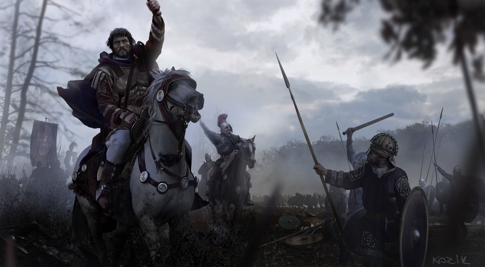

# Sisteme inteligente

## ~ Course support ~
  ## ~ Probabilities and Bayes' Nets ~
  - [Berkeley video lectures (Lectures 12, 16, 17, 18, 19)](http://ai.berkeley.edu/lecture_videos.html)
  - [Indian video lecture series on Artificial Intelligence by Prof. Dasgupta (Lectures 21, 22, 23, 24, 25)](https://www.youtube.com/playlist?list=PLvx5ei9aEEqJBDBLV3ELK4PKEgnFeOrw6)
  
  ## ~ Machine Learning ~
  - [Stanford Machine Learning Course by Prof. Andrew Ng on Cousera platform (until week 5 of the course with Neural Networks)](https://www.coursera.org/learn/machine-learning)
  - [FastAI by Jeremy Howard (More for understanding further topics in Deep Learning and for having a practical perspective of the field)](https://course.fast.ai/videos/?lesson=1)

## ~ Laboratory ~
  
  ## Lab 1
  - [Recap counting methods, probabilities and Bayes Theorem (Starting from video 61 to 75)](https://www.youtube.com/playlist?list=PLHXZ9OQGMqxersk8fUxiUMSIx0DBqsKZS)
  - [Gödel's Incompleteness Theorem](https://www.youtube.com/watch?v=O4ndIDcDSGc)
  
  ## Lab 2
  - [Pomegranate tutorial](https://github.com/jmschrei/pomegranate/blob/master/tutorials/B_Model_Tutorial_4_Bayesian_Networks.ipynb)
  - [Two Generals' Problem](https://www.youtube.com/watch?v=s8Wbt0b8bwY)
  - [Byzantine Generals Problem](https://www.youtube.com/watch?v=SF362xxcfdk&t=4m40s)
  
  ## Lab 3
  - [Pomegranate bug fix and 4-node network example](https://github.com/jmschrei/pomegranate/issues/672)
  - [Monty Hall problem explained](https://www.youtube.com/watch?v=4Lb-6rxZxx0)
  - [Pareto principle (80/20 principle) explained](https://youtu.be/EAynHZE-lK4)
  - [Black SWAN Event by Nicholas Taleb](https://youtu.be/BDbuJtAiABA)
  
  ## Lab 4
   ### More Bayes nets examples in Pomegranate 
  - [ASIA Example](https://github.com/jmschrei/pomegranate/blob/master/examples/bayesnet_asia.ipynb)
  - [Huge Monty Hall Problem](https://github.com/jmschrei/pomegranate/blob/master/examples/bayesnet_huge_monty_hall.ipynb)
  - [BONUS Coronavirus - Why is better to "panic" early? Black SWAN Event talk with Nicholas Taleb and Yaneer Bar-Yam](https://youtu.be/e2Kga5HeAqk)
  
  ## Lab 5 
   ### Recap and project preparation
  - [Fuzzy logic - another way of dealing with uncertainty](https://www.youtube.com/watch?v=r804UF8Ia4c)
  
  ## Lab 6
  ## Probabilities examination
  
  ## Lab 7
  - [Machine Learning introduction and categories](https://towardsdatascience.com/machine-learning-an-introduction-23b84d51e6d0)
  - [Python recap and important features used in Machine Learning](https://www.kaggle.com/learn/python)
  - [Google Colab with Jupyter notebook integration](https://colab.research.google.com)
  - [DeepFakes available for everyone now and 1 million dollars prize to detect it on the Kaggle competition. :)](https://youtu.be/mUfJOQKdtAk)
  
  ## Lab 8
  - [Occam's razor - Simple is best!](https://www.techopedia.com/how-does-occams-razor-apply-to-machine-learning/7/33087)
  
  ### Perceptron
  
  - [Perceptron Part 1](https://medium.com/@thomascountz/perceptrons-in-neural-networks-dc41f3e4c1b9)
  - [Perceptron AND Gate Part 1](https://medium.com/@thomascountz/tdd-ing-a-perceptron-in-ruby-by-implementing-and-part-1-234c9527ec66)
  - [Perceptron AND Gate Part 2](https://medium.com/@thomascountz/perceptron-implementing-and-part-2-84bfb1f46597)
  - [Perceptron Full](https://medium.com/@thomascountz/19-line-line-by-line-python-perceptron-b6f113b161f3)
  
  - [BONUS: Perceptron with Cross-Validation](https://machinelearningmastery.com/implement-perceptron-algorithm-scratch-python/)
  - [GPT-2: AI that creates stories.](https://openai.com/blog/better-language-models/)
  - [Use GPT-2 live.](https://talktotransformer.com/)
  - [Play AIDungeons](https://play.aidungeon.io/)

 ## Lab 9 
 - [Neural Network from scratch in Python](https://victorzhou.com/blog/intro-to-neural-networks/)
 - [Linear Regression in PyTorch](PyTorchIntroduction/SimpleLinearRegressionInPyTorch.ipynb)
 - [Diabetes prediction in PyTorch](PyTorchIntroduction/DiabetesExample.ipynb)
 
 
 ## Lab 10
 
 - [Simple Heart Disease classification using train and validation set](PyTorchIntroduction/SimpleLinearRegressionInPyTorch.ipynb)
 - [MiniBatch Heart Disease classification using train and validation set](PyTorchIntroduction/MiniBatchHeartDiseasePytorch.ipynb)
 ### Theory
 - [Analyze each feature in the dataset](https://towardsdatascience.com/exploratory-data-analysis-with-pandas-profiling-de3aae2ddff3)
 - [Overfitting(high variance) vs Underfitting(high bias)](https://towardsdatascience.com/what-are-overfitting-and-underfitting-in-machine-learning-a96b30864690)
 - [No free lunch theorem](https://www.kdnuggets.com/2019/09/no-free-lunch-data-science.html)
 - [Are you suffering from the curse of knowledge?](https://www.lifehack.org/articles/communication/are-you-suffering-from-the-curse-knowledge.html)
 - [Curse of knowledge video example with experiment.](https://youtu.be/w3jte8XzvGU)
 - [5 Ways to reverse the curse of knowledge.](https://customer.io/blog/curse-of-knowledge/)

## You after this lab! (in picture, general Flavius Belisarius after his stunning victory at the Battle of Dara)

